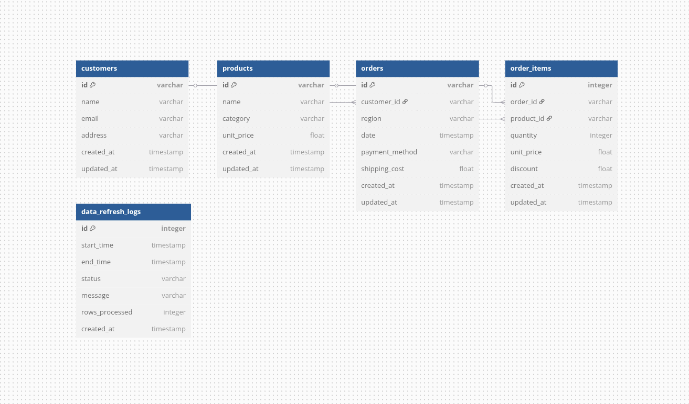

# Lumel - Sales Data Analytics API

A Go application for processing, storing, and analyzing sales data.

## Features

- Data import from CSV files
- Database storage with PostgreSQL
- RESTful API for data analysis
- Customer analytics
- Docker support for easy deployment

## Project Structure

```
.
├── cmd/
│   ├── loaddata/   # Data import utility
│   └── lumel/      # Main application entry point
├── data/           # Directory for data files
├── internal/
│   ├── api/        # HTTP handlers and routes
│   ├── config/     # Application configuration
│   ├── database/   # Database models and connection
│   ├── repository/ # Data access layer
│   ├── service/    # Business logic
│   └── utils/      # Utility functions
├── docker-compose.yml
├── Dockerfile
├── .env.example
└── go.mod
```

## Database Schema



The database consists of the following tables:

- **customers**: Stores customer information
  - id (primary key)
  - name
  - email
  - address
  - created_at
  - updated_at

- **products**: Manages product details
  - id (primary key)
  - name
  - category
  - unit_price
  - created_at
  - updated_at

- **orders**: Tracks customer orders
  - id (primary key)
  - customer_id (foreign key to customers.id)
  - region
  - date
  - payment_method
  - shipping_cost
  - created_at
  - updated_at

- **order_items**: Links orders with products and quantities
  - id (primary key)
  - order_id (foreign key to orders.id)
  - product_id (foreign key to products.id)
  - quantity
  - unit_price
  - discount
  - created_at
  - updated_at

- **data_refresh_logs**: Logs data refresh operations
  - id (primary key)
  - start_time
  - end_time
  - status
  - message
  - rows_processed
  - created_at

```

## Building and Running with Docker

1. Clone the repository:
   ```bash
   git clone git@github.com:sanjaykishor/lumel.git
   cd lumel
   ```

2. Make sure you have your sales data CSV file in the `data/` directory:
   ```bash
   mkdir -p data
   # Copy your sales.csv file to the data/ directory
   ```

3. Build and start the containers:
   ```bash
   docker-compose build
   docker-compose up -d
   ```

4. Check if the containers are running:
   ```bash
   docker-compose ps
   ```

5. View logs from the containers:
   ```bash
   docker-compose logs -f
   ```

6. Access the API:
   ```
   http://localhost:8080/api/v1/analysis/customer
   ```

7. Stop the containers:
   ```bash
   docker-compose down
   ```

8. If you need to completely reset (including database volumes):
   ```bash
   docker-compose down -v
   ```

The Docker setup includes:
- PostgreSQL database container
- Lumel API server container with the CSV data mounted from your local `data/` directory

## Running Locally

1. Install dependencies:
   ```bash
   go mod download
   ```

2. Start the API server:
   ```bash
   go run cmd/lumel/main.go
   ```

3. Import data (if needed):
   ```bash
   go run cmd/loaddata/main.go -csv /path/to/sales.csv
   ```

## API Endpoints

| Route | Method | Description | Request Body/Parameters | Sample Response |
|-------|--------|-------------|------------------------|----------------|
| `/api/v1/health` | GET | Health check endpoint to verify the API is running | None | `{"status":"ok"}` |
| `/api/v1/analysis/customer` | GET | Get customer analysis data with date range filtering | **Query Parameters**:<br>- `start_date`: Start date (YYYY-MM-DD)<br>- `end_date`: End date (YYYY-MM-DD) | ```json<br>{"total_customers":3,"total_orders":6,"average_order_value":785.42}``` |
| `/api/v1/data/refresh` | POST | Trigger a data refresh from CSV file | None (uses CSV path from env) | ```json<br>{"success":true,"message":"Data loaded successfully","start_time":"2025-05-04T07:45:35.43Z","end_time":"2025-05-04T07:45:35.45Z","rows_processed":6}``` |
| `/api/v1/data/refresh/history` | GET | Get history of data refresh operations | None | ```json<br>[{"ID":1,"StartTime":"2025-05-04T07:45:35.43Z","EndTime":"2025-05-04T07:45:35.45Z","Status":"COMPLETED","Message":"Data loaded successfully","RowsProcessed":6,"CreatedAt":"2025-05-04"}]``` |

### GET /api/v1/health

Health check endpoint to verify if the API is running.

**Response Format**

```json
{
  "status": "ok"
}
```

### GET /api/v1/analysis/customer

Get customer analysis data with optional date range filtering.

**Request Format**

Query Parameters:
- `start_date` (required): Start date for analysis in YYYY-MM-DD format
- `end_date` (required): End date for analysis in YYYY-MM-DD format

Example:
```
GET /api/v1/analysis/customer?start_date=2025-05-01&end_date=2025-05-04
```

**Response Format**

```json
{
  "total_customers": 123,
  "total_orders": 456,
  "average_order_value": 99.95
}
```

### POST /api/v1/data/refresh

Trigger a data refresh from CSV file.

**Request Format**

No request body needed. The application will use the CSV path configured in the environment variables.

**Response Format**

```json
{
  "success": true,
  "message": "Data loaded successfully",
  "start_time": "2025-05-04T14:30:00Z",
  "end_time": "2025-05-04T14:31:25Z",
  "rows_processed": 1000
}
```

Error Response:
```json
{
  "success": false,
  "message": "Failed to refresh data",
  "error": "File not found at specified path"
}
```

### GET /api/v1/data/refresh/history

Get the history of data refresh operations.

**Response Format**

```json
[
  {
    "ID": 1,
    "StartTime": "2025-05-04T07:45:35.431Z",
    "EndTime": "2025-05-04T07:45:35.457Z",
    "Status": "COMPLETED",
    "Message": "Data loaded successfully",
    "RowsProcessed": 6,
    "CreatedAt": "2025-05-04T07:45:35.458Z"
  }
]
```


